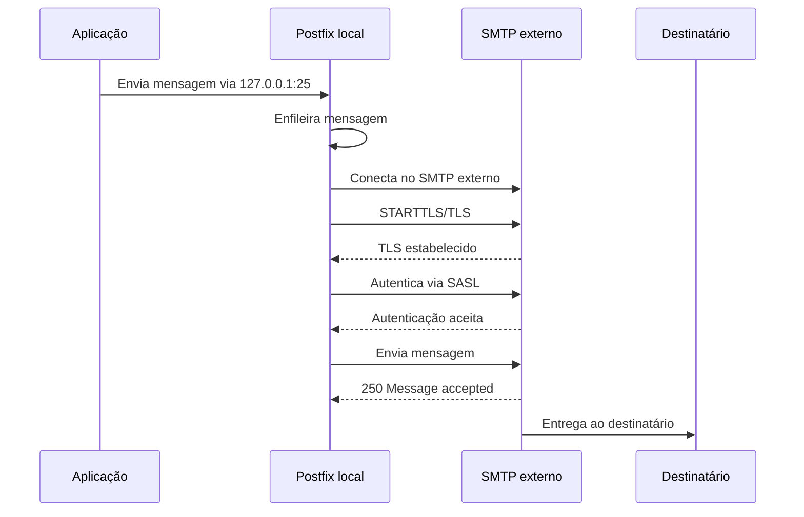

# Postfix SMTP Relay


## Sobre o projeto

O **Postfix SMTP Relay** é uma solução em português para configurar o **Postfix como relay SMTP local** para aplicações legadas.

A proposta é permitir que uma aplicação antiga envie e-mails para `127.0.0.1:25`, enquanto o Postfix fica responsável por autenticação SMTP, STARTTLS/TLS, fila, logs, retry e encaminhamento para o servidor SMTP externo.

Essa abordagem é útil quando a aplicação não consegue negociar corretamente TLS moderno ou autenticação SMTP, mas ainda precisa enviar mensagens por uma infraestrutura de e-mail atual.

---

## Índice

- [Problema resolvido](#problema-resolvido)
- [Como a solução funciona](#como-a-solução-funciona)
- [Arquitetura](#arquitetura)
- [Funcionalidades](#funcionalidades)
- [Estrutura do projeto](#estrutura-do-projeto)
- [Instalação rápida](#instalação-rápida)
- [Instalação com variáveis](#instalação-com-variáveis)
- [Configuração na aplicação](#configuração-na-aplicação)
- [Testes disponíveis](#testes-disponíveis)
- [Validação completa](#validação-completa)
- [Interface web local](#interface-web-local)
- [Relatório técnico](#relatório-técnico)
- [Troubleshooting rápido](#troubleshooting-rápido)
- [Segurança](#segurança)
- [Documentação](#documentação)
- [Roadmap](#roadmap)
- [Autor](#autor)
- [Licença](#licença)

---

## Problema resolvido

Aplicações legadas podem falhar ao enviar e-mails diretamente para servidores SMTP modernos que exigem:

- SMTP AUTH;
- STARTTLS;
- TLS 1.2 ou superior;
- remetente autorizado;
- políticas mais rígidas contra relay aberto.

Erros comuns:

```text
535 Authentication Failed
554 Relaying Denied
SSLHandshakeException
Connection timed out
```

Com esta solução, a aplicação deixa de negociar TLS diretamente. O Postfix assume essa responsabilidade.

---

## Como a solução funciona

A aplicação passa a enviar e-mails localmente:

```text
127.0.0.1:25
```

O Postfix recebe essa mensagem local e encaminha para o SMTP externo com:

- autenticação SMTP;
- STARTTLS/TLS;
- controle de fila;
- retry automático;
- logs detalhados.

---

## Arquitetura

### Antes


### Depois


### Fluxo técnico



---

## Funcionalidades

- [x] Configuração do Postfix como relay SMTP local.
- [x] Suporte a STARTTLS.
- [x] Suporte a TLS 1.2.
- [x] SMTP AUTH via SASL.
- [x] Instalador em Bash.
- [x] Backup antes de alterar configurações.
- [x] Script de rollback.
- [x] Scripts de teste.
- [x] Validação completa em um único comando.
- [x] Interface web local para validação.
- [x] Relatório técnico local.
- [x] GitHub Actions para validação de Shell.
- [x] ShellCheck.
- [x] Verificação básica contra dados sensíveis.
- [x] Documentação em português.
- [ ] Playbook Ansible.
- [ ] Dockerfile para laboratório.
- [ ] GitHub Pages.
- [ ] Exemplos por stack de aplicação.

---

## Estrutura do projeto

```text
.
├── README.md
├── LICENSE
├── CHANGELOG.md
├── CONTRIBUTING.md
├── SECURITY.md
├── ROADMAP.md
├── instalador
│   ├── instalar-postfix-relay.sh
│   ├── rollback.sh
│   └── validar-instalacao.sh
├── documentacao
│   ├── 01-visao-geral.md
│   ├── 02-arquitetura.md
│   ├── 03-instalacao.md
│   ├── 04-configuracao.md
│   ├── 05-validacao.md
│   ├── 06-testes.md
│   ├── 07-troubleshooting.md
│   ├── 08-seguranca.md
│   ├── 09-faq.md
│   ├── 10-roadmap.md
│   └── 11-interface-web.md
├── exemplos
├── testes
│   ├── testar-conectividade.sh
│   ├── testar-dns.sh
│   ├── testar-fila.sh
│   ├── testar-openssl.sh
│   ├── testar-postfix.sh
│   ├── testar-swaks.sh
│   └── testar-tudo.sh
├── scripts
│   └── gerar-relatorio.sh
├── web
│   ├── app.py
│   ├── requirements.txt
│   ├── static
│   └── templates
└── .github
    └── workflows
        └── ci.yml
```

---

## Instalação rápida

```bash
git clone git@github.com:otaviox3/postfix-smtp-relay.git
cd postfix-smtp-relay

chmod +x instalador/*.sh testes/*.sh scripts/*.sh
sudo ./instalador/instalar-postfix-relay.sh
```

---

## Instalação com variáveis

```bash
sudo SMTP_HOST="smtp.exemplo.com" \
SMTP_PORT="25" \
TLS_MODE="starttls" \
TLS_PROTOCOL="TLSv1.2" \
SMTP_USER="naoresponda@exemplo.com" \
SMTP_PASS="SENHA_AQUI" \
MAIL_FROM="naoresponda@exemplo.com" \
TEST_TO="destino@exemplo.com" \
RUN_SEND_TEST="yes" \
./instalador/instalar-postfix-relay.sh
```

---

## Configuração na aplicação

Após instalar o relay local, configure a aplicação assim:

```text
Host SMTP: 127.0.0.1
Porta SMTP: 25
SSL: desabilitado
STARTTLS: desabilitado
Autenticação SMTP: desabilitada
Remetente: e-mail autorizado no SMTP externo
```

> [!IMPORTANT]
> A aplicação não deve autenticar no Postfix local. Quem autentica no SMTP externo é o Postfix.

---

## Testes disponíveis

### DNS

```bash
SMTP_HOST="smtp.exemplo.com" ./testes/testar-dns.sh
```

### Conectividade

```bash
SMTP_HOST="smtp.exemplo.com" SMTP_PORT="25" ./testes/testar-conectividade.sh
```

### TLS

```bash
SMTP_HOST="smtp.exemplo.com" SMTP_PORT="25" TLS_MODE="starttls" ./testes/testar-openssl.sh
```

### SMTP AUTH com Swaks

```bash
SMTP_HOST="smtp.exemplo.com" \
SMTP_PORT="25" \
SMTP_USER="naoresponda@exemplo.com" \
SMTP_PASS="SENHA_AQUI" \
MAIL_FROM="naoresponda@exemplo.com" \
TEST_TO="destino@exemplo.com" \
./testes/testar-swaks.sh
```

### Postfix local

```bash
MAIL_FROM="naoresponda@exemplo.com" \
TEST_TO="destino@exemplo.com" \
./testes/testar-postfix.sh
```

### Fila

```bash
./testes/testar-fila.sh
```

---

## Validação completa

Execute todos os testes básicos:

```bash
SMTP_HOST="smtp.exemplo.com" \
SMTP_PORT="25" \
TLS_MODE="starttls" \
MAIL_FROM="naoresponda@exemplo.com" \
TEST_TO="destino@exemplo.com" \
./testes/testar-tudo.sh
```

---

## Interface web local

A versão v1.3 adicionou uma interface web local para validação operacional.

```bash
cd web
python3 -m venv .venv
source .venv/bin/activate
pip install -r requirements.txt
python app.py
```

Acesse:

```text
http://127.0.0.1:8080
```

A interface permite:

- validar DNS;
- validar conectividade;
- validar TLS;
- consultar fila;
- visualizar últimos logs do Postfix.

> [!WARNING]
> A interface web deve ser usada localmente ou por túnel SSH. Não exponha diretamente na internet.

---

## Relatório técnico

A versão v1.3 também adicionou geração de relatório local.

```bash
./scripts/gerar-relatorio.sh
```

O relatório inclui:

- informações do host;
- status do Postfix;
- configuração ativa;
- fila;
- últimos logs.

---

## Troubleshooting rápido

### `535 Authentication Failed`

Verifique usuário, senha, permissão de SMTP AUTH e entrada no `sasl_passwd`.

### `554 Relaying Denied`

Verifique se o Postfix autenticou corretamente e se a porta do `relayhost` corresponde à entrada do `sasl_passwd`.

### `Connection timed out`

Verifique DNS, firewall, ACL, rota e liberação da porta SMTP.

### `Different sender identity is not allowed`

Verifique se o remetente usado pela aplicação é o mesmo autorizado no servidor SMTP externo.

---

## Segurança

Nunca suba credenciais reais para o GitHub.

Arquivos sensíveis:

```text
/etc/postfix/sasl_passwd
/etc/postfix/sasl_passwd.db
.env
*.secret
__pycache__/
*.pyc
```

Use exemplos genéricos:

```text
smtp.exemplo.com
naoresponda@exemplo.com
SENHA_AQUI
```

---

## Documentação

- [Visão geral](documentacao/01-visao-geral.md)
- [Arquitetura](documentacao/02-arquitetura.md)
- [Instalação](documentacao/03-instalacao.md)
- [Configuração](documentacao/04-configuracao.md)
- [Validação](documentacao/05-validacao.md)
- [Testes](documentacao/06-testes.md)
- [Troubleshooting](documentacao/07-troubleshooting.md)
- [Segurança](documentacao/08-seguranca.md)
- [FAQ](documentacao/09-faq.md)
- [Roadmap](documentacao/10-roadmap.md)
- [Interface web](documentacao/11-interface-web.md)

---

## Roadmap

- [x] Instalador interativo.
- [x] Documentação em português.
- [x] GitHub Actions.
- [x] Script de rollback.
- [x] Validação completa.
- [x] Interface web local.
- [x] Relatório técnico.
- [ ] Exemplos por aplicação.
- [ ] Playbook Ansible.
- [ ] Dockerfile de laboratório.
- [ ] GitHub Pages.

---

## Autor

Desenvolvido por **Otávio Azevedo**.

Projeto criado como estudo e documentação prática de uma solução de infraestrutura para compatibilizar aplicações legadas com servidores SMTP modernos.

---

## Licença

Este projeto está licenciado sob a licença MIT.
