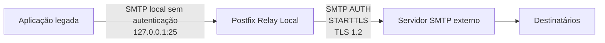
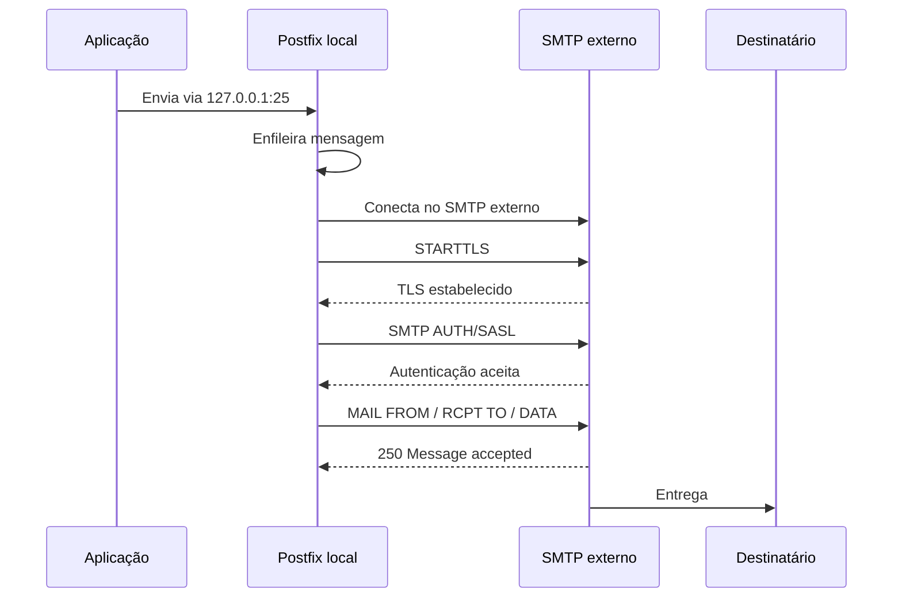

# Postfix SMTP Relay


## Sobre o projeto

Este projeto fornece uma solução para configurar o **Postfix como relay SMTP local** para aplicações legadas que precisam enviar e-mails por meio de servidores SMTP modernos com autenticação, STARTTLS e TLS.

A aplicação envia e-mails para `127.0.0.1:25`, e o Postfix fica responsável por autenticar, negociar TLS, enfileirar, registrar logs e encaminhar a mensagem para o servidor SMTP externo.

## Índice

- [Problema resolvido](#problema-resolvido)
- [Arquitetura](#arquitetura)
- [Benefícios](#benefícios)
- [Instalação rápida](#instalação-rápida)
- [Configuração esperada na aplicação](#configuração-esperada-na-aplicação)
- [Testes](#testes)
- [Troubleshooting rápido](#troubleshooting-rápido)
- [Documentação](#documentação)
- [Roadmap](#roadmap)

## Problema resolvido

Aplicações legadas podem apresentar erros ao tentar enviar e-mails diretamente para servidores SMTP que exigem autenticação e TLS moderno.

```text
535 Authentication Failed
554 Relaying Denied
SSLHandshakeException
Connection timed out
```

## Arquitetura

### Antes


### Depois



### Fluxo técnico



## Benefícios

- Compatibilidade com aplicações legadas.
- Nenhuma alteração obrigatória no código da aplicação.
- Autenticação SMTP centralizada no Postfix.
- STARTTLS/TLS tratado pelo Postfix.
- Fila local de mensagens.
- Retry automático.
- Logs detalhados via `journalctl`.
- Facilidade para trocar o servidor SMTP futuramente.

## Instalação rápida

```bash
git clone git@github.com:otaviox3/postfix-smtp-relay.git
cd postfix-smtp-relay
chmod +x instalador/instalar-postfix-relay.sh
sudo ./instalador/instalar-postfix-relay.sh
```

## Instalação com variáveis

```bash
sudo SMTP_HOST="smtp.exemplo.com" \
SMTP_PORT="25" \
TLS_MODE="starttls" \
TLS_PROTOCOL="TLSv1.2" \
SMTP_USER="naoresponda@exemplo.com" \
SMTP_PASS="SENHA_AQUI" \
MAIL_FROM="naoresponda@exemplo.com" \
TEST_TO="destino@exemplo.com" \
RUN_SEND_TEST="yes" \
./instalador/instalar-postfix-relay.sh
```

## Configuração esperada na aplicação

```text
Host SMTP: 127.0.0.1
Porta SMTP: 25
SSL: desabilitado
STARTTLS: desabilitado
Autenticação: desabilitada
Remetente: e-mail autorizado no SMTP externo
```

> [!IMPORTANT]
> A aplicação não precisa conhecer usuário, senha ou TLS. Quem faz isso é o Postfix.

## Testes

```bash
SMTP_HOST="smtp.exemplo.com" SMTP_PORT="25" ./testes/testar-conectividade.sh
SMTP_HOST="smtp.exemplo.com" SMTP_PORT="25" TLS_MODE="starttls" ./testes/testar-openssl.sh
MAIL_FROM="naoresponda@exemplo.com" TEST_TO="destino@exemplo.com" ./testes/testar-postfix.sh
```

## Logs

```bash
journalctl -fu postfix
postqueue -p
postsuper -d ALL
```

## Resultado esperado

```text
Trusted TLS connection established
status=sent
250 Message accepted
```

## Troubleshooting rápido

### 535 Authentication Failed

Verifique usuário SMTP, senha SMTP, permissão de SMTP AUTH, arquivo `sasl_passwd` e execução do `postmap`.

### 554 Relaying Denied

Verifique autenticação SASL, porta configurada no `relayhost`, porta configurada no `sasl_passwd` e retorno do `postmap -q`.

### Connection timed out

Verifique firewall, ACL, rota e liberação da porta SMTP.

## Segurança

Nunca suba credenciais reais para o GitHub. Use exemplos como `smtp.exemplo.com` e `naoresponda@exemplo.com`.

## Documentação

- [Visão geral](documentacao/01-visao-geral.md)
- [Arquitetura](documentacao/02-arquitetura.md)
- [Instalação](documentacao/03-instalacao.md)
- [Configuração](documentacao/04-configuracao.md)
- [Validação](documentacao/05-validacao.md)
- [Testes](documentacao/06-testes.md)
- [Troubleshooting](documentacao/07-troubleshooting.md)
- [Segurança](documentacao/08-seguranca.md)
- [FAQ](documentacao/09-faq.md)
- [Roadmap](documentacao/10-roadmap.md)

## Roadmap

- [x] Instalador interativo.
- [x] STARTTLS/TLS 1.2.
- [x] SMTP AUTH via SASL.
- [x] Scripts de teste.
- [x] Documentação em português.
- [x] Script de rollback básico.
- [ ] Playbook Ansible.
- [ ] Dockerfile para laboratório.
- [ ] GitHub Pages.

## Autor

Desenvolvido por **Otávio Azevedo**.
