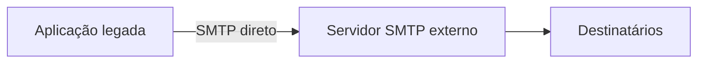
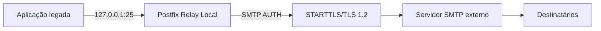
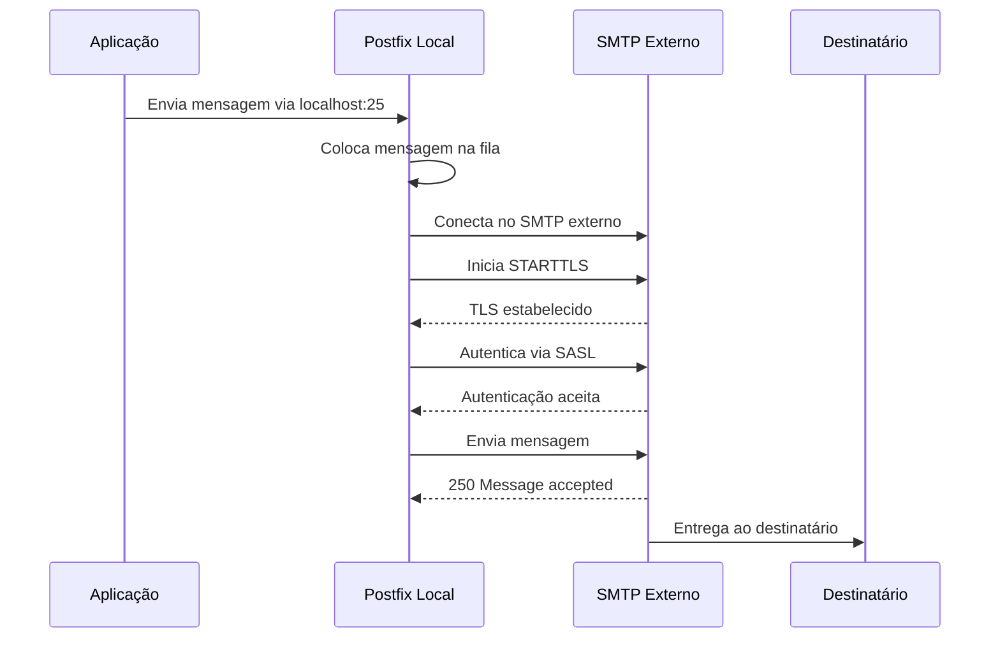

# Arquitetura

## Modelo antes da solução

Antes da implantação do relay local, a aplicação se conectava diretamente ao SMTP externo.

Nesse modelo, a aplicação precisa lidar com:

- autenticação;
- TLS;
- certificados;
- compatibilidade de protocolo;
- erros de entrega.

## Modelo depois da solução

Com o Postfix local, a aplicação envia para `127.0.0.1:25`.

## Sequência técnica

## Responsabilidades

| Componente | Responsabilidade |
|---|---|
| Aplicação | Enviar e-mail para `127.0.0.1:25` |
| Postfix | TLS, autenticação, fila, logs e encaminhamento |
| SMTP externo | Receber e entregar mensagens autenticadas |
| Destinatário | Receber a mensagem |
