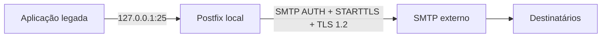

# Validação

## Resumo

Este capítulo faz parte da documentação do projeto **Postfix SMTP Relay**.

A solução permite que aplicações legadas enviem e-mails para `127.0.0.1:25`, enquanto o Postfix realiza autenticação SMTP, STARTTLS/TLS, fila, logs e encaminhamento externo.

## Fluxo principal



## Comandos úteis

```bash
postconf -n
journalctl -fu postfix
postqueue -p
```
